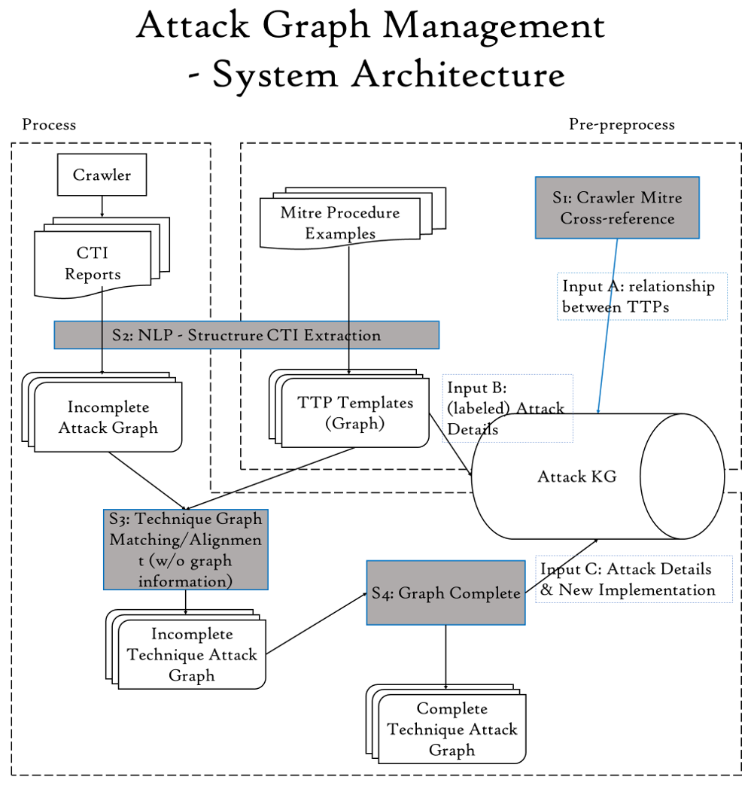
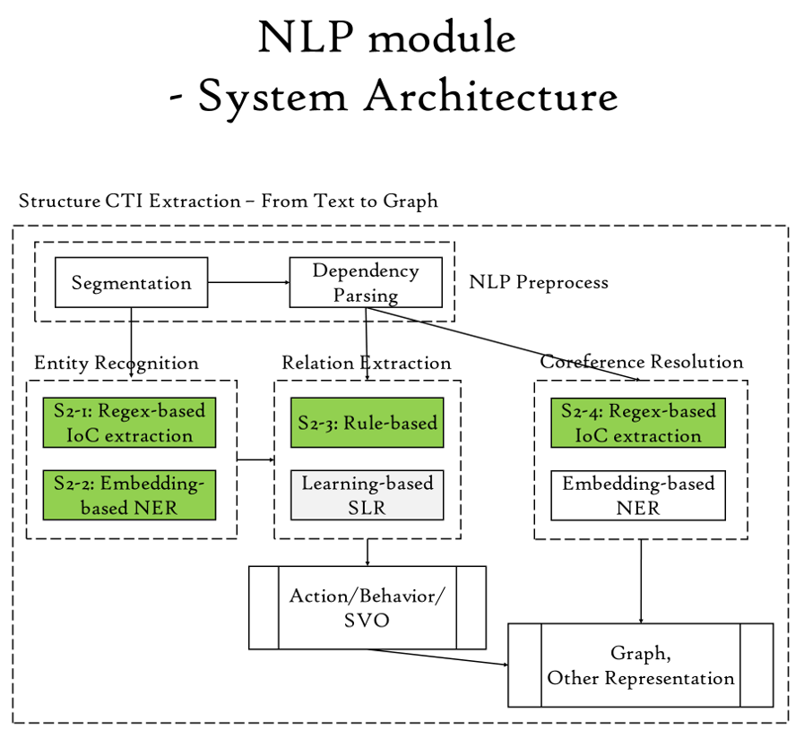

# AttacKG: Practical CTI Report Parsing & Threat Intelligence KG Building
Building a Knowledge Graph for cyber attack with information extracted from Cyber Threat Intelligence reports.

## S1: Crawler Mitre Cross-reference
`Mitre_TTPs/mitre_attack_retrieve.ipynb`

## S2: NLP- Structure CTI Extraction

### S2-1 Regex-based IoC extraction 
`NLP/extract_IoC_with_regex.py`

### S2-2 Embedding-basd NER
`NLP/ner_with_spacy.ipynb`
`NLP/nlp_parser.ipynb`
